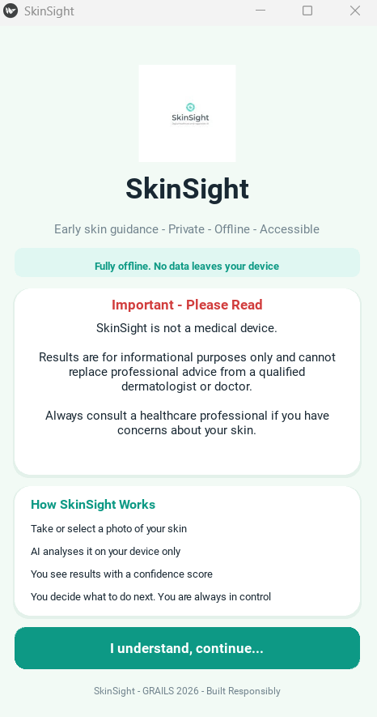
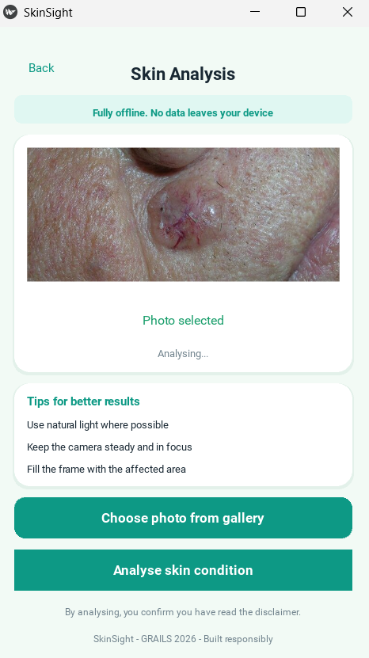
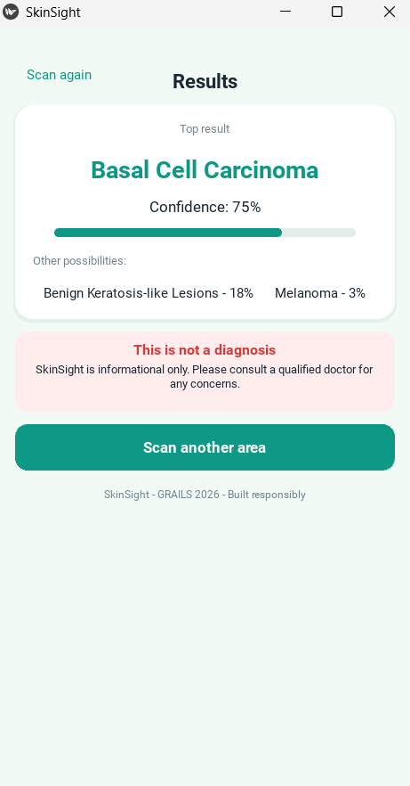

# SkinSight
Local AI model to scan skin and detect different skin conditions.

UI Walkthrough
## Screenshots
### Disclaimer Screen

### Camera Screen

### Results Screen

## Contributions 

1. Fork the repository and create a feature branch
2. Submit a pull request with a clear description of your changes
3. All contributions must maintain the project's responsible AI 
   principles, so that privacy, transparency and fairness are preserved.
